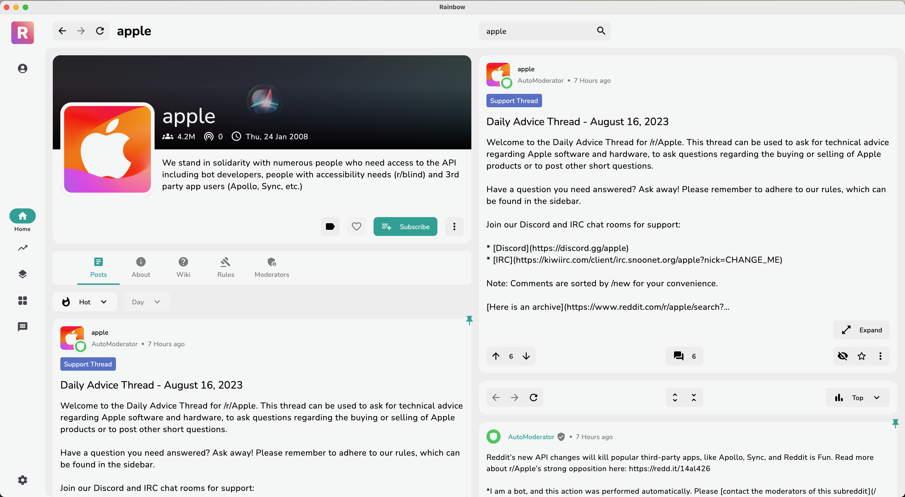

<h1 align="center">
<s> Rainbow for Reddit</s> RIP
</h1> 

<h3 align="center">
Unique Desktop Client for Browsing Reddit
</h3>

## Setup

1. Create an app on your Reddit account using <a href="https://www.reddit.com/prefs/apps">this</a> link.
2. Put https://rainbow.fly.dev/ in the `redirect uri` field. Check out [Rainbow for Reddit - API](https://github.com/alialbaali/Rainbow-for-Reddit-API).
3. Submit, and copy the Client ID.
4. Clone the repository.
5. Insert the Client ID in the `ClientID` field into
   the `remote/src/main/kotlin/com/rainbow/remote/RainbowProperties.kt` file.
6. Run the app.

## Support

## License

Rainbow for Reddit is distributed under the terms of the Apache License (Version 2.0). See [License](LICENSE) for details.